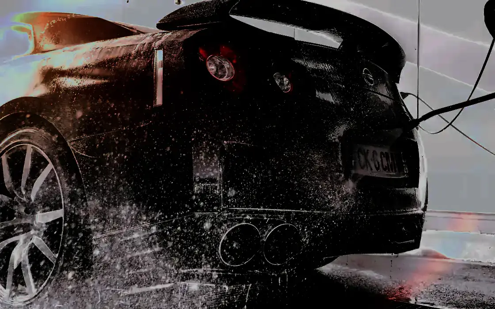

# Golden Ride Car Care — concept demo

Static, framework-free demo site prepared for **Golden Ride Car Care** (Umm Ramool, Dubai).
English + Arabic (full RTL). No analytics, no build step, `noindex`.

## Run locally

```powershell
python -m http.server 8080
# or: npx serve .
```

Open http://localhost:8080 — add `?lang=ar` to preview Arabic.

## Placeholders to fill (all defined at the top of `main.js`, `CONFIG`)

| Key | Current value | What to put there |
|---|---|---|
| `WHATSAPP_NUMBER` | `{{WHATSAPP_NUMBER}}` | Full international number, digits only (e.g. `971551411012`). Until filled, WhatsApp buttons open the WhatsApp share picker with the message instead of a specific chat. |
| `PHONE` | `{{PHONE}}` | Display phone number. Two candidates found — **+971 55 141 1012** (Instagram bio, emiratesbz, garagefinder) vs **+971 56 117 9794** (Google/Yango/2GIS). Confirm which is current before showing. |
| `HOURS` | `{{HOURS}}` | Opening hours. Sources disagree: Google mirror says 09:00–22:00 daily, 2GIS says 08:00–22:00. Confirm on Google Maps. |
| `GOOGLE_RATING` / `GOOGLE_REVIEWS` | `4.8` / `22` | From a 2026-09-14 listing mirror. A magicpin mirror shows 4.7 / 28. **Verify live in Google Maps** (Sort by Newest) before showing the owner. |

Also replace in `index.html` (2 places): the `og:image` / `twitter:image` absolute URL
(`https://YOUR-DOMAIN.example/og-image.png` → real URL once hosted). Local file: `assets/og-image.png`.

## Removing the preview bar

The top line ("Concept preview prepared for…") is plain HTML in `index.html`
(`<div class="concept-bar">`). Hide it with one class: add `hide-concept` to `<body>`,
or delete the div when the site becomes real.

## Swapping in real photos

All images are designed placeholders (dark plate, gold hairline, PHOTO label) —
no usable photos were available (Instagram posts sit behind a login wall; Google Maps
photos can't be fetched without their API; third-party aggregator photos have unknown
provenance and were not used).

Expected files in `assets/photos/` (see `SOURCES.md`):

| File | Where it goes | Aspect |
|---|---|---|
| `hero.webp` (+ `hero.jpg`) | replace `.plate-hero` in the hero | 4:3 landscape, ≥1600px wide, ≤200 KB |
| `g1…g6.webp` (+ `.jpg`) | replace the six `.ph` plates in the gallery | see table in SOURCES.md, ≤120 KB each |

Pattern for each swap:

```html
<!-- before -->
<div class="plate ph g1" role="img" aria-label="…"><span class="ph-tag">Photo</span></div>
<!-- after -->

```

Keep the class (`g1`…`g6`, `plate-hero`) so the layout does not change; give each `img`
`width`/`height`, `loading="lazy"` (except hero), and bilingual alt text (put `lang` on the
alt or keep both languages in the attribute, e.g. `alt="PPF applied on a dark sedan / تطبيق حماية الطلاء"`).

Gold hue was **not** retuned (no photos yet) — after real photos land, the `--gold` token in
`styles.css` may be shifted up to 6° in hue to match the paint tones.

## Files

- `index.html` — semantic structure, OG/Twitter tags, SVG icon symbols
- `styles.css` — design tokens on `:root`, CSS logical properties (RTL), mobile-first
- `main.js` — `CONFIG` placeholders, one copy dictionary (EN/AR), language toggle
  (`?lang=ar`, localStorage in try/catch), reveal-on-scroll, WhatsApp link builder.
  Arabic copy is listed in a comment block at the end of `main.js` for review.
- `assets/fonts/` — 4 self-hosted woff2; `assets/photos/SOURCES.md` — expected photo filenames
- `assets/og-image.png` — 1200×630 share card, rendered from `og.html` (dev-only, not linked
  from the site; re-render after copy changes)

## Design system (as specified)

Warm near-black `#0B0A09`, champagne gold `#C8A96A` under 5% of any screen (hairlines,
numerals, primary CTA only), Bodoni Moda + Archivo for Latin, Reem Kufi + Readex Pro for
Arabic, all self-hosted woff2 (~111 KB total, `font-display: swap`, preloaded critical pair).
Motion is transform/opacity only, `cubic-bezier(.2,.7,.2,1)` 600–900 ms, disabled under
`prefers-reduced-motion`.
